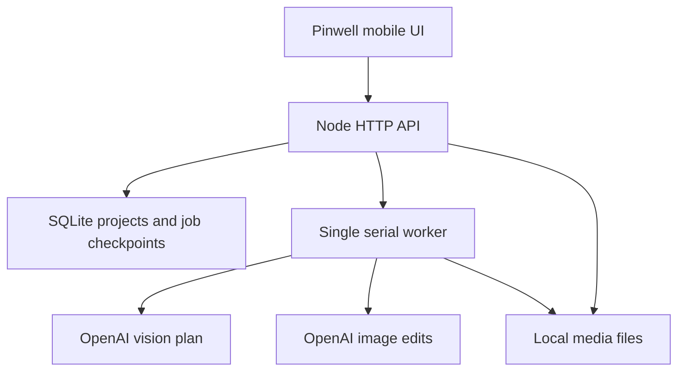

# AI canvas architecture

## Components



The browser never holds an API key. The same Node process serves the static app and API so no CORS configuration or cross-origin session token is needed. No frontend build step or external runtime npm package is required.

## Lifecycle

`queued-plan → planning → review → queued-images → rendering → complete`

Failures become `failed`; server restarts become `interrupted`; user cancellations become `cancelled`. Only explicit resume retries missing work. The `approved` flag is durable and prevents a plan recovered after cancellation from skipping review. Review is a separate user action before the seven image requests.

Each completed image is persisted immediately. Finished target and step checkpoints are separate, so a failure at step 5 does not regenerate steps 1–4. Provider timeout is five minutes per call. A browser poll does not execute the job; closing the page does not stop the Node worker. Stopping the Node process does stop generation.

## API

All state-changing requests must send `Origin: PUBLIC_ORIGIN`. With an app password, all routes except login require the session cookie. Without a password the server binds to loopback by default. Non-loopback bind is rejected unless a sufficient password is set.

| Route | Purpose |
| --- | --- |
| `POST /api/login` | Password login; returns HttpOnly session cookie |
| `GET /api/status` | Configured flag, mock flag, model names, call ceiling; never returns a key |
| `GET /api/projects` | List persisted projects |
| `POST /api/projects` | Upload/fetch reference and queue plan; requires `Idempotency-Key` |
| `GET /api/projects/:id` | Poll job state and retrieve lesson |
| `POST /api/projects/:id/generate` | Approve validated lesson plan and queue images |
| `POST /api/projects/:id/resume` | Explicitly resume failed, interrupted, or cancelled work |
| `POST /api/projects/:id/cancel` | Stop after active provider request |
| `POST /api/projects/:id/progress` | Save zero-based completed step indices |
| `GET /api/projects/:id/images/:name` | Authenticated image bytes (`reference`, `final`, `step-1`…`step-6`) |
| `GET /api/projects/:id/export` | JSON package with inline images for archiving |

Example creation payload:

```json
{
  "title": "Moonlit mountains",
  "sourcePinId": "existing-browser-pin-id",
  "sourceURL": "https://www.pinterest.com/pin/123/",
  "imageURL": "https://i.pinimg.com/564x/example.jpg",
  "medium": "Acrylic",
  "difficulty": "Beginner",
  "shape": "Portrait",
  "notes": "Simplify the trees and use fewer colors."
}
```

`imageData` can replace `imageURL`: a data URL containing PNG, JPEG, or WebP bytes. The illustrative URL above is not an actual image. References are bounded to 8 MB, JSON requests to 12 MB. Source URL is attribution metadata only, never a generic server-side fetch target. Outbound thumbnail fetches permit exact `i.pinimg.com` HTTPS with no custom port, credentials, or redirects. Uploaded files and generated images are verified by signature; full image decoding is delegated to the provider/browser.

## Provider adapter

`plan(reference, options, signal) → validated lesson plan`

`image({reference, final, previous, plan, opts, index}, signal) → image bytes`

`index=null` produces the finished target. Indices 0–5 produce cumulative steps. Image input order is source, target, previous step. Structured plan schema has supplies, palette/mixes, fixed composition, and exactly six instructions, visual descriptions, and completion checks. Returned JSON is validated again server-side. Model-generated text is escaped by the UI.

Models, quality, and per-day call limit are environment-configured. The backend fixes the OpenAI API origin; a client cannot redirect the API key to another provider. Do not add arbitrary base-URL input to the browser.

## Deliberate boundaries

- No API credentials, fabricated AI results, or live-model test results included.
- No promise that generated steps are technically or visually consistent; inspect the first live project.
- No distributed queue, scheduling service, automatic billable retries, or multi-user isolation.
- No automatic synchronization of legacy local-storage boards across devices.
- No OAuth Pinterest connection, private-board scraping, or full-resolution recovery guarantee.
- No browser code can read the old hosted domain's storage; use export/import.
- Source exports preserve existing built-in art. New generations use user-selected references.

## Before expanding beyond personal use

Replace the shared workspace with explicit users/project ownership; move media to object storage; introduce a lease-based distributed queue; add provider usage/cost telemetry and reconciliation for ambiguous timeouts. Avoid concurrent processes writing the same personal-server queue. Keep project access checks at the API boundary when multi-user support is added.
